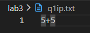
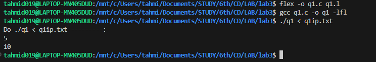
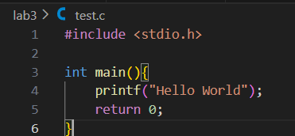
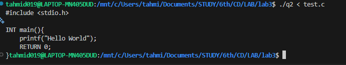
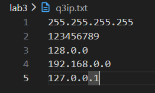
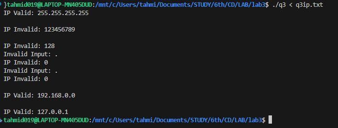

# 10-02-2026's programs:
1. Write a lex program to implement a simple calculator
2. Write a lex program to identify the keywords in a C file and convert it into upper case.
3. Write a lex program to check whether IP address entered by user is valid or not.

## Solution Outputs

1. Q1 output: the last number displayed is the result
input: 5 + 5

---

2. Q2

 

---

3. Q3 output

